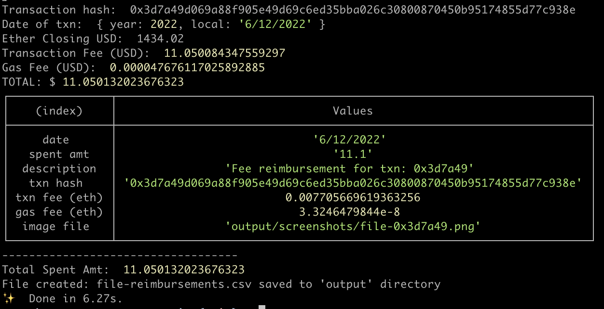

# Etherscan Txn Reimbursement

Gas & Txn fee reimbursements made easy (for cornbase employees).

**Why did I make this?** After tediously copying & pasting tiny amounts, tracking totals on a spreadsheet, and collecting screenshots of each transaction page, I thought to myself ... "programmer, know your power".

### Setup

Install

```
yarn install
```

### Generate Artifacts + CSV file

Generates `<filename>-reimbursements.csv` file and screenshots to the `output/` directory.

**(1) Get all transactions from an address**

Script will find all txns for an address, and visit each txn page to generate data & assets.

⚠️ If you've a large number of transactions, running by address will go through _every_ one of them.

Copy `.env.sample` to `.env` and update with your address

```bash
cp .env.sample .env
```

```bash
yarn generate:address
```

**(2) Get list of transactions from text file**

Create file `txns.txt` and list transaction hash on each line

```bash
touch txns.txt
```

```bash
yarn generate:file
```



### Clear files

**Clear artifacts**

```bash
yarn clear:artifacts
```

**Clear csv**

```bash
yarn clear:csv
```
